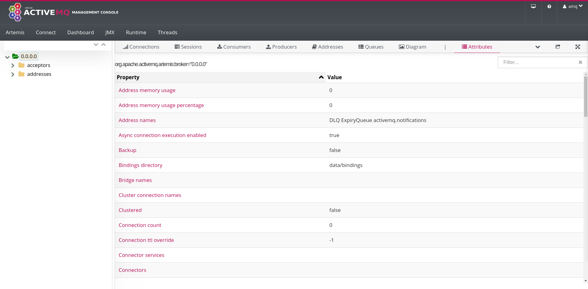

# 1. Broker.

A **broker** is a directory that contains configuration and data, for example, `broker-1`. The broker configuration references the unzipped ActiveMQ Artemis directory, which is the directory that contains all the necessary libraries to run the broker. The artemis script file contained in the unzipped ActiveMQ Artemis directory does not run a broker itself. On the contrary, it is a tool to create broker directories easily.

Table of Contents:

1. [Create a broker](#1-create-a-broker).
2. [List broker subdirectories](#2-list-broker-subdirectories).
3. [List broker configuration files](#3-list-broker-configuration-files).
4. [Create a user](#4-create-a-user).

## 1. Create a broker.

1. Create a secured standalone broker:

```bash
artemis/bin/artemis create brokers/broker-1 --user amq --password amq-password --require-login
```

2. Run the broker:

```bash
brokers/broker-1/bin/artemis run
```

Open the broker web console: 



Link: http://localhost:8161/console/login.

## 2. List broker subdirectories.

1. List the directories under the `broker-1` directory:

```bash
tree -L 1 brokers/broker-1/
```

Expected output:
```bash
brokers/broker-1/
├── bin
├── data
├── etc
├── lib
├── lock
├── log
└── tmp

7 directories, 0 files
```

Each subdirectory purpose:

- **bin:** contains broker artemis and artemis-service scripts.
- **data:** contains broker data, messages data, and paging.
- **etc:** contains broker configuration.
- **lib:** empty by default, serves to keep extra libraries.
- **lock:** contains cli.lock file.
- **log:** contains artemis.log, and audit.log files.
- **tmp:** empty by default, serves to keep the web console application.

## 3. List broker configuration files.

1. List the files under the `etc` directory:

```bash
tree -L 1 brokers/broker-1/etc/
```

Expected output:
```bash
brokers/broker-1/etc/
├── artemis.profile
├── artemis-roles.properties
├── artemis-users.properties
├── bootstrap.xml
├── broker.xml
├── jolokia-access.xml
├── logging.properties
├── login.config
└── management.xml

0 directories, 9 files
```

Each configuration file purpose:
- **artemis.profile:** contains the unzipped ActiveMQ Artemis directory reference, and Java options, for example, RAM.
- **artemis-roles.properties:** contains the roles and their users configuration.
- **artemis-users.properties:** contains the users and their passwords configuration.
- **bootstrap.xml:** contains most ot the web console configuration, for example, SSL.
- **broker.xml:** contains most of the broker configuration.
- **jolokia-access.xml:** contains Jolokia security configuration.
- **logging.properties:** contains the broker JBoss Logging framework configuration.
- **login.config:** contains the login configuration.
- **management.xml:** contains the web console authorisation configuration.

## 4. Create a user.

1. Create a user:

```bash
brokers/broker-1/bin/artemis user add --user user --password user-password --role user-role
```

Expected output:

```bash
User added successfully.
```

> **Note:** The artemis script used is located under brokers/broker-1/bin/ directory and not under artemis/bin/ directory.

2. Create a queue:

```bash
vim brokers/broker-1/etc/broker.xml
```

BEFORE:

```xml
      ...
      <addresses>
         <address name="DLQ">
            <anycast>
               <queue name="DLQ" />
            </anycast>
         </address>
         <address name="ExpiryQueue">
            <anycast>
               <queue name="ExpiryQueue" />
            </anycast>
         </address>

      </addresses>
      ...
```

AFTER:

```xml
      ...
      <addresses>
         <address name="myapp.exampleQueue">
            <anycast>
               <queue name="myapp.exampleQueue" />
            </anycast>
         </address>
         <address name="DLQ">
            <anycast>
               <queue name="DLQ" />
            </anycast>
         </address>
         <address name="ExpiryQueue">
            <anycast>
               <queue name="ExpiryQueue" />
            </anycast>
         </address>

      </addresses>
      ...
```

3. Grant permissions:

BEFORE:

```xml
      ...
      <security-settings>
         <security-setting match="#">
            <permission type="createNonDurableQueue" roles="amq"/>
            <permission type="deleteNonDurableQueue" roles="amq"/>
            <permission type="createDurableQueue" roles="amq"/>
            <permission type="deleteDurableQueue" roles="amq"/>
            <permission type="createAddress" roles="amq"/>
            <permission type="deleteAddress" roles="amq"/>
            <permission type="consume" roles="amq"/>
            <permission type="browse" roles="amq"/>
            <permission type="send" roles="amq"/>
            <!-- we need this otherwise ./artemis data imp wouldn't work -->
            <permission type="manage" roles="amq"/>
         </security-setting>
      </security-settings>
      ...
```

AFTER:

```xml
      ...
      <security-settings>
         <security-setting match="#">
            <permission type="createNonDurableQueue" roles="amq"/>
            <permission type="deleteNonDurableQueue" roles="amq"/>
            <permission type="createDurableQueue" roles="amq"/>
            <permission type="deleteDurableQueue" roles="amq"/>
            <permission type="createAddress" roles="amq"/>
            <permission type="deleteAddress" roles="amq"/>
            <permission type="consume" roles="amq"/>
            <permission type="browse" roles="amq"/>
            <permission type="send" roles="amq"/>
            <!-- we need this otherwise ./artemis data imp wouldn't work -->
            <permission type="manage" roles="amq"/>
         </security-setting>
         <security-setting match="myapp.#">
            <permission type="consume" roles="user-role"/>
            <permission type="browse" roles="user-role"/>
            <permission type="send" roles="user-role"/>
         </security-setting>
      </security-settings>
      ...
```

## References.

References:
- [Security](https://activemq.apache.org/components/artemis/documentation/latest/security.html)

